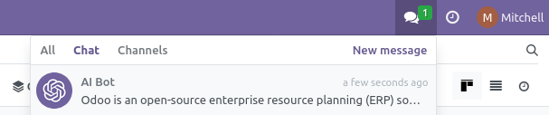
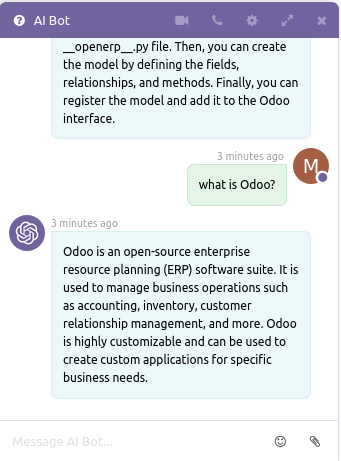
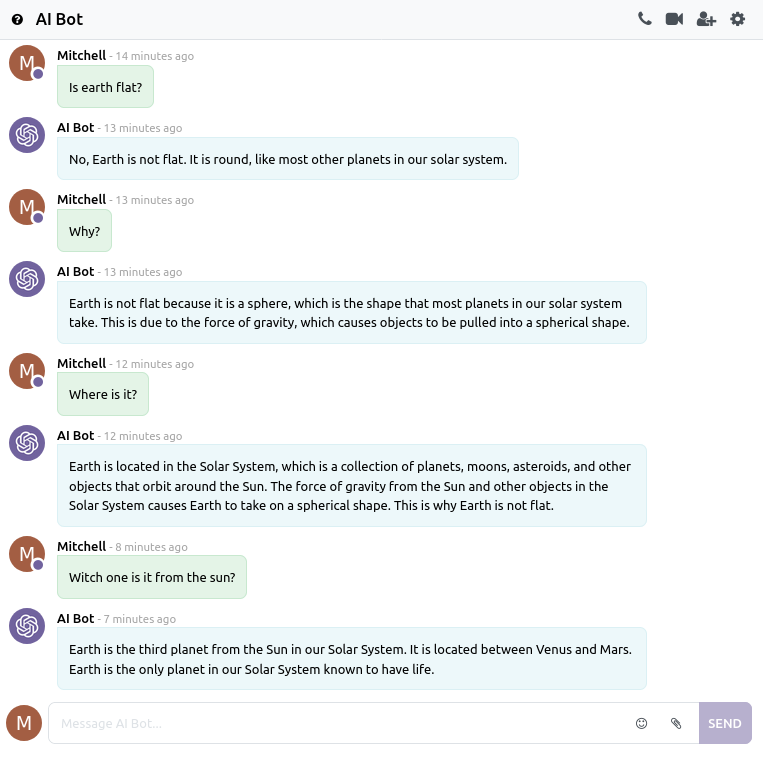
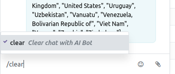
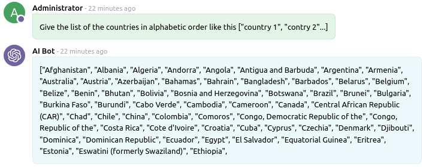
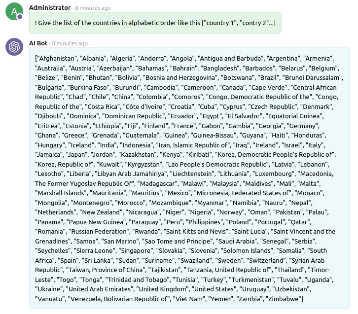

 

OpenAI Chat
===================

This module adds an AI Bot user to chat with like in ChatGPT.

## Usage

Open a chat and start talking to AI Bot:

Or go is **Discuss**:

### Clear the chat

use the command **/clear** to clear the chat:

### Boost AI Bot answer

By default, AI Bot answer length is limited. To get longer answer, start your prompt with an exclamation mark, so AI Bor will use a maximum of tokens to answer.

## Requirements

**openai_connector** is required. 

This module requires the Python client library for OpenAI API

    pip install openai

## Maintainer

* This module is maintained by [Michel Perrocheau](https://github.com/myrrkel). 
* Contact me on [LinkedIn](https://www.linkedin.com/in/michel-perrocheau-ba17a4122). 

