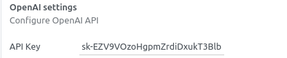
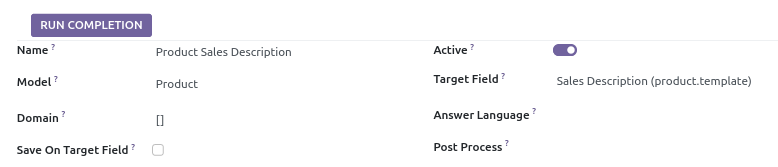
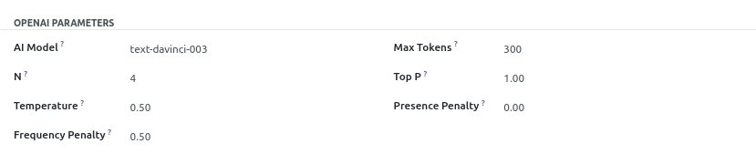
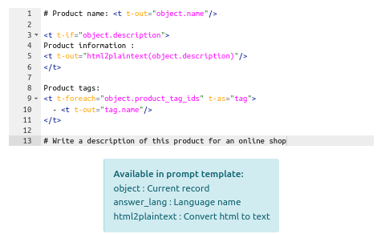
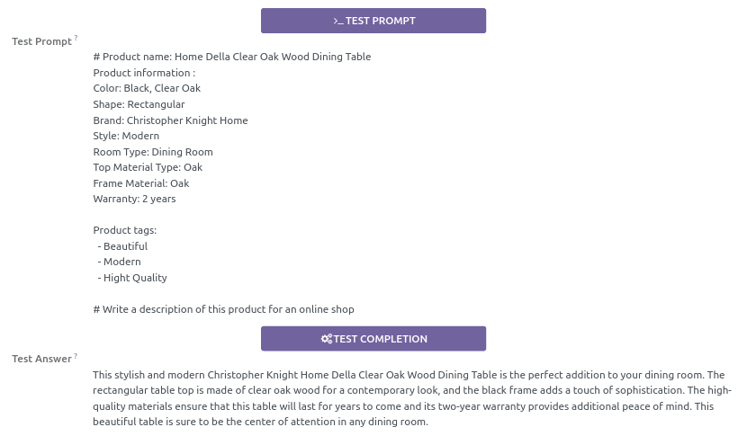

 

OpenAI Connector
=================

This technical module provides a connector for the OpenAI API and allows integration of ChatGPT and DALL-E capabilities within Odoo.
ChatGPT4 and DALL·E 3 are available.

It can be used as a playground to test OpenAI tools in Odoo but does not have standalone functionality.
The module is intended to be inherited by other modules for specific use cases, such as: 
 - [openai_chat](../openai_chat/README.md): Adding an AI bot user for interactive chat using ChatGPT
 - [openai_edit_product_image](../openai_edit_product_image/README.md): Generating a new product image from a cropped image using DALL-E
 - [openai_product_description](../openai_product_description/README.md): Generating sales descriptions for products using ChatGPT
 - [openai_product_tags](../openai_product_tags/README.md): Generating product tags using ChatGPT

To create custom OpenAI completions, edits, or images, refer to the API documentation for proper configuration of API parameters. 

[OpenAI API Documentation](https://beta.openai.com/docs/api-reference/introduction)

## Configuration

Create an account on [https://beta.openai.com/](https://beta.openai.com/)

Generate your API key: [API keys](https://beta.openai.com/account/api-keys)

In **Settings**, fill the **API Key** field with your generated key.

## Usage

### OpenAI Completion

To create a new **OpenAI Completion**, go to **Settings**, **Technical**, **OpenAI Completion** and create a new record.

**Model**: The model on witch the completion will be applied.

**Target Field**: The field where the generated value will be saved.

**Domain**: The domain to select the records on witch the completion will be run.

Check the [API Documentation](https://beta.openai.com/docs/api-reference/introduction) to set **OpenAI Parameters** values.

For Completion results go to **Settings**, **Technical**, **OpenAI Completion Results**

### OpenAI Image

To create a new **OpenAI Image**, go to **Settings**, **Technical**, **OpenAI Image** and create a new record.

For results go to **Settings**, **Technical**, **OpenAI Image Results**

### Prompt template

Write a prompt template in Qweb.

Available functions in prompt template:
 - object : Current record
 - answer_lang : Function returning the language name
 - html2plaintext : Function to convert html to text

### Tests

Test actions use the first record of the model selected by the domain.

Test first your prompt to adjust your template, then test the result of the Completion, Edit or Image to adjust OpenAI parameters.

## Requirements

This module requires the Python client library for OpenAI API

    pip install openai>=1.6.1

## Maintainer

* This module is maintained by [Michel Perrocheau](https://github.com/myrrkel). 
* Contact me on [LinkedIn](https://www.linkedin.com/in/michel-perrocheau-ba17a4122). 

