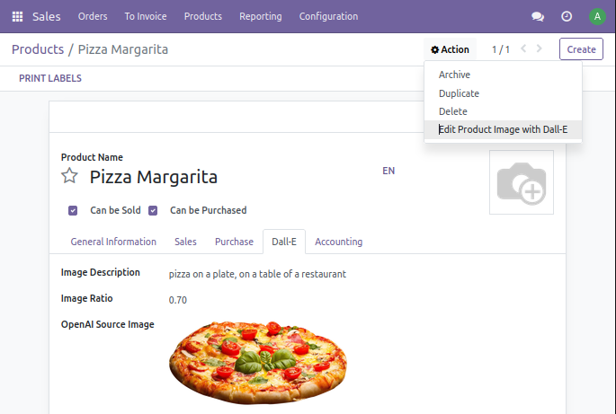
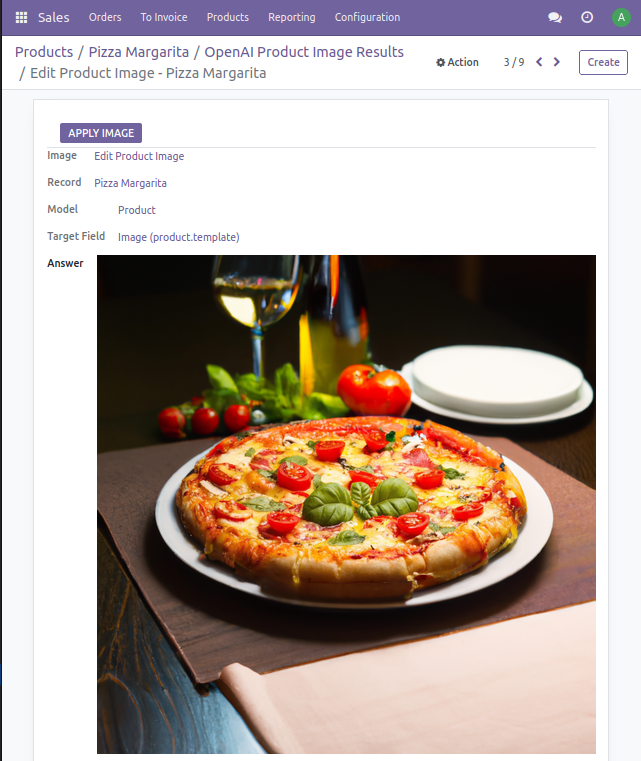
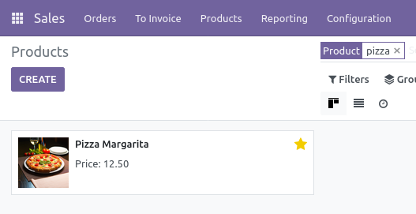
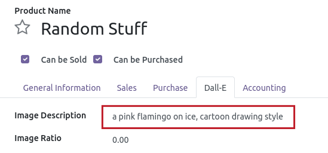
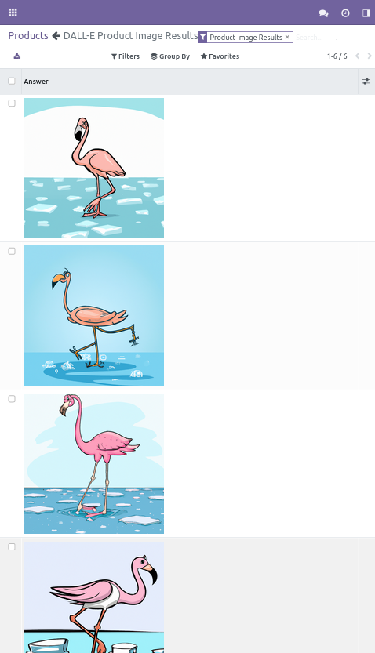

 

OpenAI Edit Product Image
=========================

This module allows to generate a new product image from a cropped product image with DALL-E.

## Usage

On a product, select **DALL-E** tab, add a PNG image with transparency or add a mask image, and write a description of the result you want:

You can also set an image ratio.

Go in menu **Action** and select **Edit Product Image with DALL-E**:

Select the image you prefer and click on **Apply Image** to set is as product image :

Action **Edit Product Image with DALL-E** is also available from the product list view.

## Create a product image from scratch

Leave the **Source Image** field empty, select **Edit Product Image with DALL-E** action.

This option will turn any product into a DALL-E playground...

*You can also update the template "edit_product_image_template" to create your own prompt from your product properties.*

## Requirements

[openai_connector](../openai_connector/README.md) is required. 

This module requires the Python client library for OpenAI API

    pip install openai

## Maintainer

* This module is maintained by [Michel Perrocheau](https://github.com/myrrkel). 
* Contact me on [LinkedIn](https://www.linkedin.com/in/michel-perrocheau-ba17a4122). 

