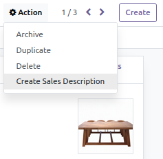
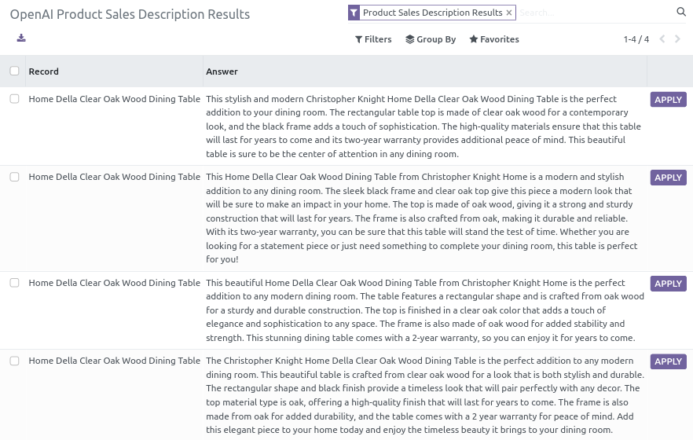

 

OpenAI Product Description
==========================

This module allows to generate a product sales description with OpenAI's GTP3 model from product tags, attributes or any other product information.

## Usage

On a product, select **Create Sales Description** action :

OpenAI will create 4 description proposals. Choose the one you prefer (you can correct it), then, click on **Apply** to save the value as the product sales description.

This action is also available from the product list view.

## Requirements

[openai_connector](../openai_connector/README.md) is required. 

This module requires the Python client library for OpenAI API

    pip install openai

## Maintainer

* This module is maintained by [Michel Perrocheau](https://github.com/myrrkel). 
* Contact me on [LinkedIn](https://www.linkedin.com/in/michel-perrocheau-ba17a4122). 

